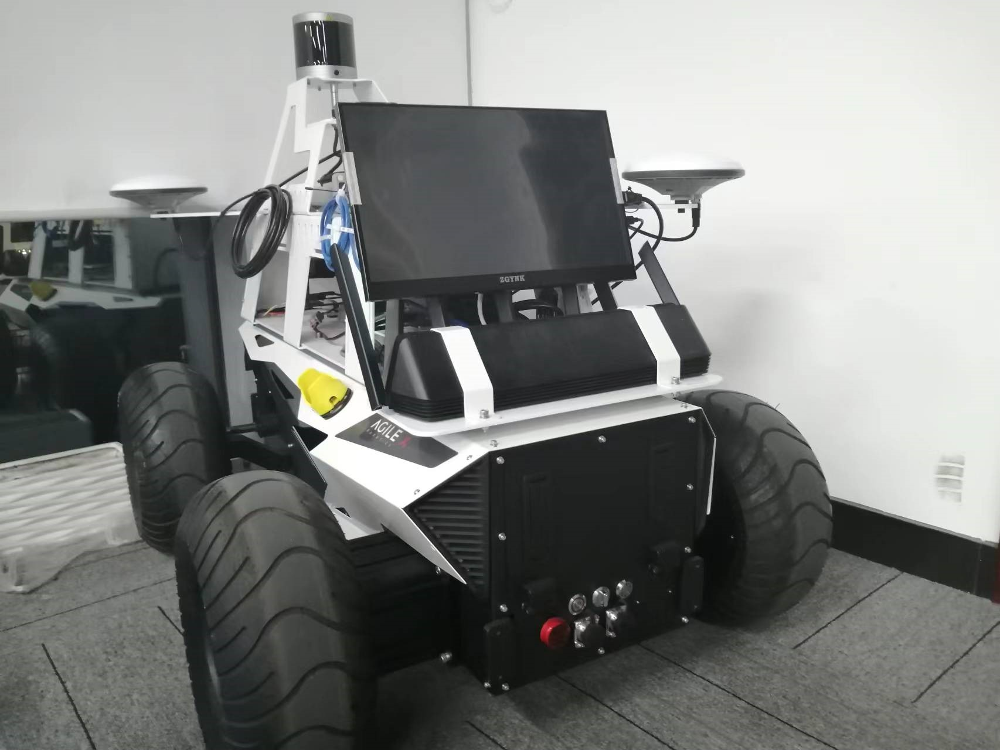
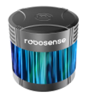
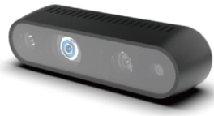
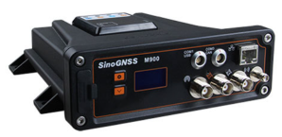
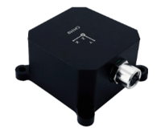
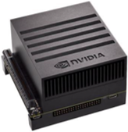

---

---

# Autonomous Navigation System

## 基于[Autoware](https://github.com/autowarefoundation/autoware)的自主导航系统

## 简介

我们开源了一套适用于城市动态环境的自主导航系统。

## 目录

- [硬件平台](#硬件平台)

- [系统架构](#系统架构)

- [程序编译与运行](#程序编译与运行)

## 硬件平台




<p align='center'>
    
    
    
    
    
</p>


### 硬件型号及驱动

- 松灵HUNTER 2.0：https://github.com/agilexrobotics/hunter_ros
- 速腾聚创RS-Helios-5515：https://github.com/RoboSense-LiDAR/rslidar_sdk
- Intel Real Sense-D435i：https://www.intelrealsense.com/sdk-2/
- 司南M900D：https://github.com/ros-drivers/nmea_navsat_driver
- 超核电子CH110：https://github.com/hipnuc/products
- 英伟达（NVIDIA） Jetson AGX Orin

## 系统架构

**仿真：**


**小车：**


椭圆形内的为节点名称，连接线附近的为话题名称。

## 程序编译与运行

### 依赖

项目仅在以下系统环境中测试过。

- Ubuntu 20.04
- [ROS 2 Foxy](https://docs.ros.org/en/foxy/Installation/Ubuntu-Install-Debians.html)
- python 3.8
- [CUDA 11.4](https://docs.nvidia.com/cuda/cuda-installation-guide-linux/index.html)
- [cuDNN 8.2](https://docs.nvidia.com/deeplearning/cudnn/install-guide/index.html)
- [TensorRT 8.2](https://docs.nvidia.com/deeplearning/tensorrt/install-guide/index.html)
- [CARLA 0.9.13](https://carla.readthedocs.io/en/latest/build_linux/)

### 编译

1、使用以下指令下载并编译软件包

```xml
mkdir -p ros2_workspace/src   # "ros2_workspace"的名称可以任意指定
cd ~/ros2_workspace/src
git clone https://github.com/???????.git
cd ..
rosdep update
rosdep install --from-paths src --ignore-src -r
colcon build
```

2、设置环境变量

打开.bashrc文件，在文件末尾添加以下内容，<path-to-carla>根据自己的实际情况进行修改

```
export CARLA_ROOT=<path-to-carla>
export PYTHONPATH=$PYTHONPATH:$CARLA_ROOT/PythonAPI/carla/dist/carla-0.9.13-py3.7-linux-x86_64.egg:$CARLA_ROOT/PythonAPI/carla
```

<path-to-carla>：找到CarlaUE4.sh文件的位置，右键选择属性，用“上级文件夹”后面的内容替换掉<path-to-carla>

### 运行

**仿真**

使用以下指令运行程序

```
cd ~/ros2_simulation/src/
./run.sh
```

也可分别启动各个子模块，具体步骤如下：

1、启动Carla模拟器

```
cd $CARLA_ROOT
./CarlaUE4.sh -quality-level=Low
```

 2、使ROS和Carla之间相互通信

```
ros2 launch carla_ros_bridge carla_ros_bridge_with_example_ego_vehicle_autopilot_town10HD.launch.py
```

如未作特殊说明，ros2指令均在工作空间下运行。

3、读取Lanelet2地图，并通过rviz2可视化地图

```
ros2 launch map_launch map.launch.xml
```

4、发布坐标系“ego_vehicle"和”base_link"之间的坐标转换关系

```
ros2 run tf2_ros static_transform_publisher 0 0 0 0 0 0 ego_vehicle base_link
```

由于步骤2发布了坐标系“map"和“ego_vehicle"之间的坐标转换关系，所以通过这一步可以得到“map"和”base_link"之间的坐标转换关系

5、启动感知模块

```
ros2 launch perception_launch perception.launch.xml
```

6、启动规划模块

```
ros2 launch planning_launch planning.launch.xml
```

7、启动控制模块

```
ros2 launch odom_to_state_conversion_nodes odom_to_state_conversion_nodes.launch.py
```

```
ros2 run control_transfer control_transfer
```

```
ros2 launch trajectory_follower_nodes trajectory_follower_nodes.launch.py
```

最后，通过rviz2顶部菜单栏中的“2D Goal Pose"指定一个终点。

详细过程可见[视频](https://drive.google.com/drive/folders/1gR3YlVOxyMDS8ApfRa1mrFqYoySXrX_u?usp=sharing)。

**小车**

使用以下指令启动程序

```
cd ~/ros2_autoware_ws/src
./prepare.bash
cd ..
source install/setup.bash
ros2 launch obstacle_avoidance_launch obstacle_avoidance.launch.xml
```

也可分别启动各个子模块，具体步骤如下：

1、启动CAN接口，打开GNSS和IMU连接端口的访问权限

```
cd ~/ros2_autoware_ws/src
./prepare.bash
```

2、启动传感器及底盘驱动

```
ros2 launch driver_launch driver.launch.xml
```

如未作特殊说明，ros2指令均在工作空间下运行。

3、读取Lanelet2地图

```
ros2 launch map_launch map.launch.xml
```

4、启动感知模块和rviz2

```
ros2 launch perception_launch perception.launch.xml
```

5、启动规划模块

```
ros2 launch planning_launch planning.launch.xml
```

6、启动控制模块

```
ros2 launch trajectory_follower_nodes trajectory_follower_nodes.launch.py
```

最后，通过rviz2顶部菜单栏中的“2D Goal Pose"指定一个终点。

详细过程可见[视频](https://drive.google.com/drive/folders/1oqpulr0ISHa-RmTqdoJUZS9Z7twHpupi?usp=sharing)。
