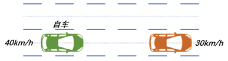
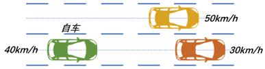

# Decision Maker

基于有限状态机的行为决策

定义了6种状态。当自车与前车距离过近则进入错误状态，在错误状态下立即规划停止。当自车在参考线上的投影点与终点的纵向距离小于距离阈值时，进入任务完成状态，距离阈值由下式确定，其中，v是自车当前速度，a是自车的最大减速度。
$$
s=\frac{{{v}^{2}}}{2a}
$$
**超车：**当自车的速度大于当前车道前方障碍物的速度，且相邻同向车道没有障碍物靠近时，进入超车状态。下面是几种典型的超车场景。

**跟车：**当自车的速度大于当前车道前方障碍物的速度，且不满足换道超车条件时，进入跟车状态。下面是几种典型的跟车场景。

## 订阅话题

| Topic                                  | Type                                               | **Description**                          |
| -------------------------------------- | -------------------------------------------------- | ---------------------------------------- |
| /carla/ego_vehicle/odometry            | nav_msgs/msg/Odometry                              | Current pose and velocity of ego vehicle |
| /map/vector_map                        | autoware_auto_mapping_msgs/msg/HADMapBin           | map information                          |
| /perception/object_recognition/objects | autoware_auto_perception_msgs/msg/PredictedObjects | tracking objects with predicted path     |
| /planning/trajectory                   | autoware_auto_planning_msgs/msg/Trajectory         | global route from start to goal          |

## 发布话题

| Topic                 | Type                          | **Description**                         |
| --------------------- | ----------------------------- | --------------------------------------- |
| /decision_maker/scene | decision_maker_msgs/msg/Scene | current scenario and related parameters |

