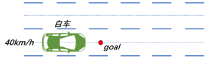
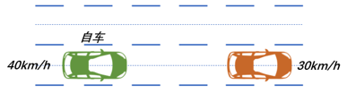
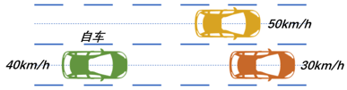
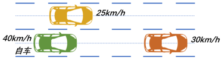

# Decision Maker代码说明

**函数名:** determineCurrentScene()

**函数位置:** decision_maker.cpp

**函数作用:** 确定当前的行驶场景

**核心代码说明：**

```c++
if(isApproachingGoal()){
    return "Complete";
}

bool isApproachingGoal(){
  FrenetState start_state;
  if(frenet_.ToFrenet(current_state_, start_state)){
    double distance_to_goal = frenet_.path_s_m.back() - start_state.s;
    if(std::abs(distance_to_goal) < distance_to_goal_thresh_){
      return true;
    }
  }
  return false;
}

```

如果自车当前位置与终点的纵向偏差小于阈值，则进入"Complete"状态




```c++
for(const auto& obstacle : obstacles_in_frenet_)
{
    // 判断车辆前方一定范围内是否有障碍物
    if(distance > 0 && distance < lon_distance_thresh && std::abs(obstacle.d) < follow_lat_distance_thresh)
    {
        is_obstacle_forward = true;
        if(distance < min_lon_distance)
        {
            min_lon_distance = distance;
            target_obstacle_ = obstacle; // 选择与自车纵向距离最小的障碍物为目标障碍物
        }
        if(distance < too_close_distance_thresh)
        {
            return "Error";
        }
    }
}
```

如果自车与前车距离过近，进入"Error"状态。


```c++
if(is_obstacle_forward)
{
  if(target_obstacle_.v > current_state_.v)
  {
    return "LaneKeep";
  }else{
    bool left_changeable = true;
    bool right_changeable = true;
    const auto & left_lane = vehicle_graph_->adjacentLeft(m_current_lanelet);
    if(left_lane)
    {
      for(const auto& obstacle : obstacles_in_frenet_)
      {
        double distance = obstacle.distance_to_ego;
        if(obstacle.d > follow_lat_distance_thresh && obstacle.d < 5.0)
        {
          if(obstacle.v < current_state_.v)
          {
            if(distance > 5.0)
            {
              left_changeable = false;
              break;
            }
          }else{
            if(distance < 30.0)
            {
              left_changeable = false;
              break;
            }
          }
        }
      }
    }else{
      left_changeable = false;
    }

    if(left_changeable)
    {
      left_bound_ = lane_width_;
      right_bound_ = 0.0;
      return "OverTake";
    }else{
      const auto & right_lane = vehicle_graph_->adjacentRight(m_current_lanelet);
      if(right_lane)
      {
        for(const auto& obstacle : obstacles_in_frenet_)
        {
          double distance = obstacle.distance_to_ego;
          if(std::abs(obstacle.d) > follow_lat_distance_thresh && std::abs(obstacle.d) < 5.0)
          {
            if(obstacle.v < current_state_.v)
            {
              if(distance > 5.0)
              {
                right_changeable = false;
                break;
              }
            }else{
              if(distance < 30.0)
              {
                right_changeable = false;
                break;
              }
            } 
          }
        }
      }else{
        right_changeable = false;
      }
      if(right_changeable)
      {
        left_bound_ = 0.0;
        right_bound_ = -lane_width_;
        return "OverTake";
      }
    }
    if(!left_changeable && !right_changeable)
    {
      return "CarFollow";
    }
  }
}else{
  return "LaneKeep";
}
```

- 如果前方一定范围内没有障碍物，或者有障碍物但是目标障碍物速度大于自车速度，进入"LaneKeep"状态，否则进行下一步判断。

- 如果前方一定范围内存在速度小于阈值的障碍物，存在同向的相邻车道，且满足以下条件，进入超车状态；否则进入车道保持状态。



​                                                                  相邻车道上没有障碍物



​				相邻车道上有障碍物，但是障碍物速度大于自车当前速度，且障碍物与自车的纵向距离较大



​			   相邻车道上有障碍物，但是障碍物速度小于自车当前速度，且障碍物与自车的纵向距离较小