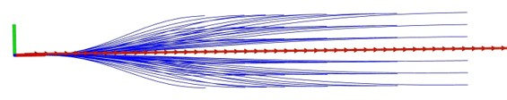
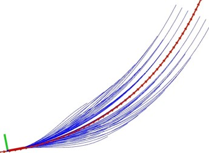
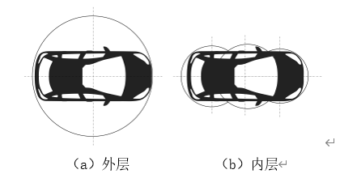
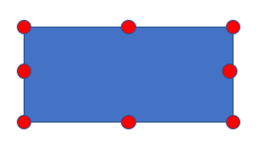

# Frenet Planner

实时规划无碰撞的局部轨迹，引导自车向终点移动。算法主要包括轨迹簇生成及评估、碰撞检测两部分。

**轨迹簇生成及评估**：在Frenet坐标系下采样一组局部目标点，然后根据目标点和当前的运动状态，使用多项式进行插值，生成满足始末状态的轨迹。对于每一个目标点都生成一条轨迹，得到一组轨迹簇，如图所示。最后，使用代价函数评估轨迹执行的代价值，并按照代价值对轨迹簇进行排序。原理可参考论文“[Optimal trajectory generation for dynamic street scenarios in a Frenét Frame](https://ieeexplore.ieee.org/document/5509799)”。

**碰撞检测**：取代价最小的轨迹，对轨迹上的所有状态点都进行碰撞检测，发生碰撞则丢弃。重复上述过程，直至找到无碰撞轨迹。碰撞检测模块将自车建模为分层外接圆，如左图所示，先检测外层，外层碰撞在检测内层。由于障碍物的尺寸不定，用八个离散点表示障碍物，如图右所示。

      

## 订阅话题

| Topic                                  | Type                                               | **Description**                          |
| -------------------------------------- | -------------------------------------------------- | ---------------------------------------- |
| /carla/ego_vehicle/odometry            | nav_msgs/msg/Odometry                              | Current pose and velocity of ego vehicle |
| /decision_maker/scene                  | decision_maker_msgs/msg/Scene                      | map information                          |
| /perception/object_recognition/objects | autoware_auto_perception_msgs/msg/PredictedObjects | tracking objects with predicted path     |
| /planning/trajectory                   | autoware_auto_planning_msgs/msg/Trajectory         | global route from start to goal          |

## 发布话题

| Topic                                               | Type                                       | **Description**                   |
| --------------------------------------------------- | ------------------------------------------ | --------------------------------- |
| /planning/scenario_planning/lane_driving/trajectory | autoware_auto_planning_msgs/msg/Trajectory | planned collision-free trajectory |
| /generated_paths_marker                             | visualization_msgs/msg/MarkerArray         | visualize a set of trajectories   |
| /frenet_planner/debug/pose_array                    | geometry_msgs/msg/PoseArray                | visualize the selected trajectory |

