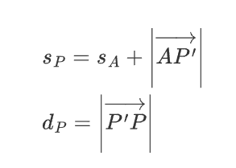
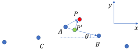
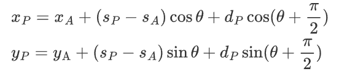

# Frenet Planner代码说明

**函数名:** CreateSPath(bool spec_origin, Point2D origin)

**函数位置:** frenet_frame.cpp

**函数作用:** 将笛卡尔坐标系下的参考线转换到frenet坐标系下

**核心代码说明：**

```c++
path_s_m[0] = 0.0;  //参考线起点的s为0
for (auto i = 1; i < path_s_m.size(); ++i) {
	//求参考线上各离散点的s
	path_s_m[i] = distance2D(path_m[i], path_m[i - 1]) + path_s_m[i - 1]; 
    ......
}
```

参考线上的离散点在frenet坐标系下的坐标为（s,d)，其中s是起点到该点的累积路程，d是该点相对于参考线的横向偏移量。由于离散点就在参考线上，所以d等于0，只需要求s。


**函数名:** ToFrenet(const VehicleState& current_state, FrenetState &state)

**函数位置:** frenet_frame.cpp

**函数作用:** 将笛卡尔坐标下的状态量转换到frenet坐标系下

**核心代码说明：**

```c++
// 找到参考线上距离车辆当前位置最近的两个点
double heading = atan2((path_m[closest_index].y - current_state.y), (path_m[closest_index].x - current_state.x));

double angle = fabs(current_state.yaw - heading);
angle = std::min(2 * pi() - angle, angle);

int next_wp_id;
if (angle > pi() / 2)
{
  next_wp_id = closest_index + 1;
}else{
  next_wp_id = closest_index;
}

if (next_wp_id >= path_m.size())
{
  next_wp_id = path_m.size() - 1;
}
int prev_wp_id = next_wp_id - 1;
if (prev_wp_id < 0)
{
  prev_wp_id = 0;
  next_wp_id = prev_wp_id + 1;
}

// n是从距离最近的两个点中索引靠前的一点到索引靠后的一点的向量
const double n_x = path_m[next_wp_id].x - path_m[prev_wp_id].x;
const double n_y = path_m[next_wp_id].y - path_m[prev_wp_id].y;
// x是从索引靠前的一点到车辆当前位置的向量
const double x_x = current_state.x - path_m[prev_wp_id].x;
const double x_y = current_state.y - path_m[prev_wp_id].y;

double proj_norm; 
if(std::abs(n_x * n_x + n_y * n_y) < 0.001){
  proj_norm = 0;
}else{
  proj_norm = (x_x * n_x + x_y * n_y) / (n_x * n_x + n_y * n_y + 0.0005);
  if(proj_norm > 1000){
    std::cout << "proj_norm is abnormal." << proj_norm<< std::endl;
  }
}
// 求向量x在向量n方向上的投影向量
const double proj_x = proj_norm * n_x;
const double proj_y = proj_norm * n_y;

// 求横向偏移量的绝对值
state.d = distance2D(x_x, x_y, proj_x, proj_y);

// 确定横向偏移量的正负号
const double pre_wp_yaw = atan2(n_y, n_x);
const double x_yaw = atan2(x_y, x_x);
const double yaw_x_n = unifyAngleRange(x_yaw - pre_wp_yaw);

if (yaw_x_n < 0.0)
{
  state.d *= -1;
}

// 通过插值求参考线上投影点的切线方向
double next_wp_yaw;
if (next_wp_id + 1 < path_m.size()){
  next_wp_yaw = atan2(path_m[next_wp_id+1].y - path_m[next_wp_id].y, path_m[next_wp_id+1].x - path_m[next_wp_id].x);
}else{
  next_wp_yaw = pre_wp_yaw;
}
const double lerp_yaw = pre_wp_yaw + proj_norm * (next_wp_yaw - pre_wp_yaw);
const double delta_yaw = unifyAngleRange(current_state.yaw - lerp_yaw);
// 求起点到该点的路程
state.s = path_s_m[prev_wp_id] + distance2D(0.0, 0.0, proj_x, proj_y);
// 速度向线段投影
state.s_d = current_state.v * cos(delta_yaw);
state.d_d = current_state.v * sin(delta_yaw);
// 其他状态量均设置为0
state.s_dd = 0.0;
state.d_dd = 0.0;
state.s_ddd = 0.0;
state.d_ddd = 0.0;
```

对于任意一点P，首先找到参考线上距离点P最近的两个点，将点P向这两点连成的线段投影，如图所示，根据公式得到s_p和d_p，那么它在frenet坐标系下的坐标为（s_p, d_p)。






**函数名:** ToCartesian(const FrenetState p_sd, Point2D &p_xy)

**函数位置:** frenet_frame.cpp

**函数作用:**  将frenet坐标系下的点转换到笛卡尔坐标系下

**核心代码说明：**

以上图为例进行说明

```c++
Point2D out = rotate(p, theta); // 求向量AP
out.x += center.x; //center为点A的笛卡尔坐标
out.y += center.y;
```



**函数名:** generateFrenetPaths(const FrenetState& curr_state, double left_bound, double right_bound, double target_speed)

**函数位置:** frenet_planner.cpp

**函数作用:**  在frenet坐标系下生成一组轨迹簇，并评估轨迹代价

**核心代码说明：**

```c++
std::vector<FrenetPath> frenet_trajs; // 轨迹簇

int path_index = 0; // 轨迹索引

// 预测时域采样
double delta_width = 0;

if(settings_.num_width == 1 || std::abs(right_bound - left_bound)<0.1){
  right_bound = 0;
  left_bound = 0;
  delta_width = settings_.lane_width;
}else{
  delta_width = (left_bound - right_bound)/(settings_.num_width - 1);
}

for (double d = right_bound; d < left_bound + delta_width / 2 ; d += delta_width) 
{
  
  const double delta_t = (settings_.max_t - settings_.min_t)/(settings_.num_t - 1);
  for (double T = settings_.min_t; T < settings_.max_t + delta_t / 2; T += delta_t)
  {
    // // 计算长度代价，轨迹越长代价越小
    const double time_cost = settings_.k_time*(1 - (T - settings_.min_t)/(settings_.max_t - settings_.min_t));

    FrenetPath frenet_traj = FrenetPath();

    // 设置横向曲线起始状态
    std::vector<double> start_d;
    start_d.emplace_back(curr_state.d);
    start_d.emplace_back(curr_state.d_d);
    start_d.emplace_back(curr_state.d_dd);

    // 设置横向曲线末端点状态
    std::vector<double> end_d;
    end_d.emplace_back(d);
    end_d.emplace_back(0.0);
    end_d.emplace_back(0.0);

    // 横向曲线用五次多项式进行插值生成
    QuinticPolynomial lateral_quintic_poly = QuinticPolynomial(start_d, end_d, T);
    
    double lat_jerk_cost = 0.0; // 横向跃度代价
    double lat_jerk_abs = 0.0;

    // 对横向曲线进行离散
    for (double t = 0.0; t <= T; t += settings_.tick_t)
    {
      frenet_traj.t.emplace_back(t);
      frenet_traj.d.emplace_back(lateral_quintic_poly.calculatePoint(t));
      frenet_traj.d_d.emplace_back(lateral_quintic_poly.calculateFirstDerivative(t));
      frenet_traj.d_dd.emplace_back(lateral_quintic_poly.calculateSecondDerivative(t));
      frenet_traj.d_ddd.emplace_back(lateral_quintic_poly.calculateThirdDerivative(t));
      lat_jerk_cost += std::pow(frenet_traj.d_ddd.back(), 2);
      lat_jerk_abs += std::abs(frenet_traj.d_ddd.back());
    }

    
    const double delta_speed = (settings_.highest_speed - settings_.lowest_speed)/(settings_.num_speed - 1 );
    // 目标速度采样
    for (double sample_speed = settings_.lowest_speed; sample_speed < settings_.highest_speed + delta_speed / 2; sample_speed += delta_speed)
    {
      FrenetPath target_frenet_traj = frenet_traj;

      // 设置纵向曲线起始状态
      std::vector<double> start_s;
      start_s.emplace_back(curr_state.s);
      start_s.emplace_back(curr_state.s_d);
      start_s.emplace_back(0.0);

      // 设置纵向曲线末端点状态
      std::vector<double> end_s;
      end_s.emplace_back(sample_speed);
      end_s.emplace_back(0.0);

      // 纵向曲线用四次多项式进行插值生成
      QuarticPolynomial longitudinal_quartic_poly = QuarticPolynomial(start_s, end_s, T);

      
      double lon_jerk_cost = 0.0; // 纵向跃度代价
      double lon_jerk_abs = 0.0;

      // 对纵向曲线进行离散
      for (double t = 0.0; t <= T; t += settings_.tick_t)
      {
        double s = longitudinal_quartic_poly.calculatePoint(t);
        if(s > frenet_.path_s_m.back()){
          continue;
        }
        target_frenet_traj.s.emplace_back(longitudinal_quartic_poly.calculatePoint(t));
        target_frenet_traj.s_d.emplace_back(longitudinal_quartic_poly.calculateFirstDerivative(t));
        target_frenet_traj.s_dd.emplace_back(longitudinal_quartic_poly.calculateSecondDerivative(t));
        target_frenet_traj.s_ddd.emplace_back(longitudinal_quartic_poly.calculateThirdDerivative(t));
        lon_jerk_cost += std::pow(target_frenet_traj.s_ddd.back(), 2);
        lon_jerk_abs += std::abs(target_frenet_traj.s_ddd.back());
      }

      // 计算速度代价
      const double speed_cost = settings_.k_lon_speed * std::pow((target_speed - target_frenet_traj.s_d.back())/settings_.highest_speed, 2);        
      
      if(lat_jerk_abs < 0.00001){
        lat_jerk_abs = 1;
      }
      if(lon_jerk_abs < 0.00001){
        lon_jerk_abs = 1;
      }
      // 计算横向偏移代价
      const double lat_d_cost = LatOffsetCost(target_frenet_traj);

      // 计算跃度代价
      lat_jerk_cost = settings_.k_lat_jerk * ((lat_jerk_cost / std::pow(settings_.max_jerk_d, 2)) / (lat_jerk_abs / settings_.max_jerk_d));
      lon_jerk_cost = settings_.k_lon_jerk * ((lon_jerk_cost / std::pow(settings_.max_jerk_s, 2)) / (lon_jerk_abs / settings_.max_jerk_s));
      // 计算总代价 
      target_frenet_traj.final_cost = settings_.k_lat * (lat_d_cost + lat_jerk_cost)
                                  + settings_.k_lon * (speed_cost + time_cost + lon_jerk_cost);
      target_frenet_traj.traj_index = path_index;
      frenet_trajs.emplace_back(target_frenet_traj);
      path_index++;

    }
  }
}

return frenet_trajs;
```


**函数名:** generateFrenetPaths(const FrenetState& curr_state, double s_goal, double target_speed)

**函数位置:** frenet_planner.cpp

**函数作用:** 在frenet坐标系下生成一组轨迹簇，轨迹末端点的s是确定的；同时评估轨迹代价。

**核心代码说明：**

```c++
// 设置纵向曲线末端点的状态
std::vector<double> end_s;
end_s.emplace_back(s_goal);
end_s.emplace_back(sample_speed);
end_s.emplace_back(0.0);

// 纵向曲线用五次多项式进行插值
QuinticPolynomial longitudinal_quartic_poly = QuinticPolynomial(start_s, end_s, T); 
```


