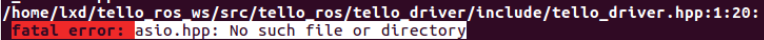
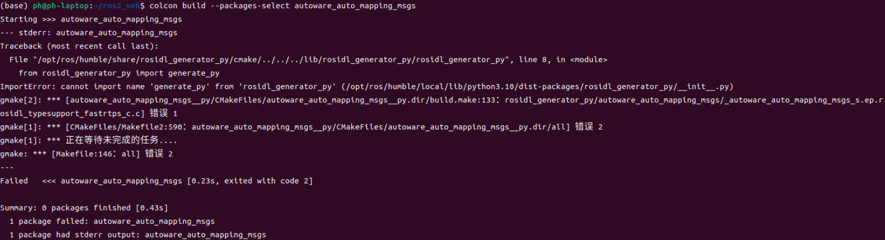
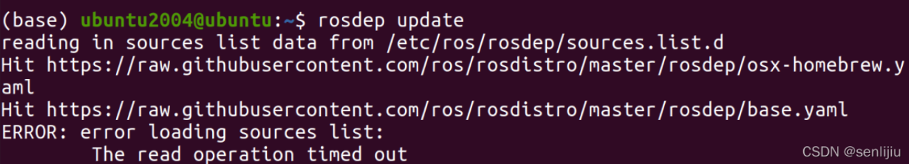

# 常见的编译问题

**1、缺少第三方库**

一般来说，找不到某个package或hpp文件，并且它不是工作空间src目录下的文件，那么很有可能是缺少C++第三库；如果是出现ImportError，那么可能是缺少python第三方库。

**1.1缺少C++库**

**CASE 1:**


可能的解决方法：

**(1)**查找可安装的**osqp-vendor**包

打开终端，输入以下指令

```
apt-cache search osqp-vendor
```

出现如下内容


**(2)**安装相应版本的**osqp-vendor**包

由于项目使用的是ROS 2 Foxy，因此安装**ros-foxy-osqp-vendor**

```
sudo apt-get install ros-foxy-osqp-vendor
```


**CASE 2:**



可能的解决方法：

**(1)**查找**asio.hpp**文件所属的第三方库

可以谷歌或百度，也可以用以下方法查找：

打开终端，输入以下指令

```
apt-cache search asio
```

出现如下内容


在上图中找到带有**asio**字符的第三方库，如下图所示，第一个是库文件，第二个是文档，只需要安装第一个。


输入如下指令：

```
sudo apt-get install libasio-dev
```


**1.2缺少python库**

**ImportError:** cannot import name 'generate_py' from 'rosidl_generator_py' (/opt/ros/humble/local/lib/python3.10/dist-packages/rosidl_generator_py/init.py)



可能的解决方法：

通过谷歌发现是缺少empy库和lark库，在终端输入以下指令进行安装

```
pip install empy
pip install lark
```


**2、找不到已经编译好的软件包的文件**

**osqp_interface**是本项目中的软件包，在**common**文件夹下，且**osqp_interface**软件包已经编译成功，但是编译**trajectory_follower**软件包时找不到它所依赖的**osqp_interface**包里面的头文件


可能的解决方法：

**(1)**将工作空间下的**build**文件夹和**install**文件夹中的**trajectory_follower**包删除

**(2)**重新编译**trajectory_follower**包

```
colcon build --packages-select trajectory_follower
```

**3、rosdep update超时**



可能的解决方法：

在终端输入以下指令

```
wget http://fishros.com/install -O fishros && . fishros
```

出现如下画面：


选择第三个安装。

然后在终端输入如下指令，注意：rosdep后面有个字母c

```
rosdepc update
rosdepc install --from-paths src --ignore-src -r
```

上面两行指令可以与下面的指令起到相同的效果。

```
rosdep update
rosdep install --from-paths src --ignore-src -r
```


4、


可能的解决方法：

在终端输入如下指令

```
cd ros2_nav        # 进入工作空间
source install/setup.bash
colcon build       # 重新编译
```

